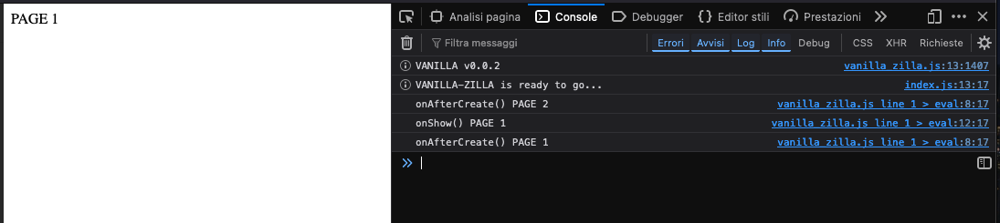

# Vanilla-Zilla


Simple javascript framework "tool-chain free".

No NPM, no NPX, no Webpack, etc... only Vanilla Javascript and your preferred libraries and components.

## Quick Start

Vanilla-Zilla works without Node, Webpack, etc..

So, you can start creating your first page, the index.html.

```html
<!DOCTYPE html>
<html lang="en">
<head>
    <title>Quick Start</title>

    <meta charset="UTF-8">
    <meta name=viewport content="width=device-width, initial-scale=1.0">


</head>
<body>

</body>
</html>
```

### 1. Include the script in your HTML head.

```html
 <!-- VANILLA SCRIPT -->
<script src="./vanilla-zilla.min.js"></script>
```

### 2. Create your main javascript launcher

Usually I call this script `index.js` (yes, not great creativity in this 😁).

[index.html]

```html
<!DOCTYPE html>
<html lang="en">
<head>
    <title>Quick Start</title>

    <meta charset="UTF-8">
    <meta name=viewport content="width=device-width, initial-scale=1.0">

    <!-- VANILLA SCRIPT -->
    <script src="../../build/vanilla_zilla.js"></script>
</head>
<body>

<script src="index.js"></script>
</body>
</html>
```

[index.js]

```javascript
/**
 * index.js
 */
!(() => {
    // set vanilla reference
    const vanilla = window.vanilla;
    if (!vanilla) {
        console.error("VANILLA-ZILLA not found!");
        return null;
    }
    // wait until VANILLA is completely loaded
    vanilla.ready((vanilla) => {
        console.info("VANILLA-ZILLA is ready to go...");

    });
})();
```

Try to open your index.html page and open developers tools to take a look at the console.

You should see something like this:


### 3. Now import or include your preferred UI libraries and frameworks.

Once you have tested that Vanilla-Zilla works, you can go on adding your preferred libreries.

I prefer TailwindCSS or Bootstrap, so in my examples may be you find those, but you can adopt what you prefer.

[index.html]

```html
<!DOCTYPE html>
<html lang="en">
<head>
    <title>Quick Start</title>

    <meta charset="UTF-8">
    <meta name=viewport content="width=device-width, initial-scale=1.0">

    <!-- TAILWIND CSS -->
    <script src=https://cdn.tailwindcss.com></script>
    <script type=application/javascript>
        tailwind.config = {
            content: ['./**/*.{html,js}',],
            darkMode: "selector", // selector, class
            plugins: [],
            theme: {}
        }
    </script>

    <!-- VANILLA SCRIPT -->
    <script src="../../build/vanilla_zilla.js"></script>
</head>
<body>

<script src="index.js"></script>
</body>
</html>
```

Now we can star adding some Vanilla-Zilla code.

### 4. Start writing your Application using imports (require) and components.

Vanilla-Zilla uses a requireJs like approach to load external files.

With `vanilla.require` you can import any kind of external resources (html, js, blob or streams).

The require method is used everytime Vanilla-Zilla includes a page in an application or a component in a view.

[index.js]

```javascript
/**
 * index.js
 */
!(() => {
    // set vanilla reference
    const vanilla = window.vanilla;
    if (!vanilla) {
        console.error("VANILLA-ZILLA not found!");
        return null;
    }
    // wait until VANILLA is completely loaded
    vanilla.ready((vanilla) => {
        console.info("VANILLA-ZILLA is ready to go...");

        // add some pages to main application.
        vanilla.app.pages.push(
            {name: "Page 1", url: "./views/page1.js", data: {"title": "Home Page"}},
            {name: "Page 2", url: "./views/page2.js", data: {"title": "Page number #2"}},
        );

        // The first page added is also the "home page"
        vanilla.app.pages.home().catch((err) => {
            console.error("Error redirecting to home page:", err);
        });
    });
})();
```

In the code above we are:

- adding some pages to our application: `vanilla.app.pages.push{...}` (it uses "require")
- navigating to the home page: `vanilla.app.pages.home()` NOTE: _the home page is the first page._

The method `vanilla.app.pages.push` send an internal request for adding "Page Items" to the main application.

A "Page Item" request is just a simple object containing three properties:

- name: Name of the page
- url: Path of the page script. NOTE: _All Vanilla-Zilla paths are relative to main root._
- data: optional model to pass to the page script

#### BUILD THE PAGES

Once we have created the Application, we will need to add some pages. Let's start to create Page1 and Page2.

In Vanilla-Zilla all visible elements are "Components", So, when you create a Page or a View you are creating also a component.

Components are compound from 2 elements:
 - UI: the user interface (HTML, CSS)
 - Business Logic: the code behind the UI

In our example here is how our pages are constructed.

[./views/page_1.html]
```html
<!DOCTYPE html>
<html lang="en">
<head>
    <meta charset="UTF-8">
    <title>Page 1</title>
</head>
<body>
<div>
  <%text%>
</div>
</body>
</html>
```

[./views/page_1.js]
```javascript
class Page1 extends vanilla.BaseView {
    constructor(...args) {
        super(...args);
        super.init("./views/page1.html", {text: "PAGE 1"});
    }

    onAfterCreate() {
        console.log("onAfterCreate()", "PAGE 1");
    }

    onShow(){
        console.log("onShow()", "PAGE 1");
    }

    onHide(){
        console.log("onHide()", "PAGE 1");
    }

}

// exports
module.exports = {Page1};
```

Page 2 is the same, so I'll not write the code for Page 2 again.

Some things to observe in this code:
 - The UI is pure HTML: all components can be written in pure HTML in a separate file. This is a great advantage when creating a UI because you can test directly in the browser. For complete testing you should add same CSS and libraries to your component as in index file. Vanilla-Zilla will import only the body of the component.
 - Paths are all relative to main toot. Even if our component UI is in same directory, the importer always considers the root.
 - While in the index.html "launcher" the HTML file included the javascript file with teh tag `<script src="index.js"></script>`, in components is the javascript file that load the HTML file using a require method (or other related methods exposed from the PAGES object or from component's constructors).


#### TRY THE CODE

Try your page now.

You should see something like screen below.



Now you can test the internal routing changing the url.

Change URL hash from `http://localhost/index.html#page_1` to `http://localhost/index.html#page_2` and back.

## Complete Documentation

- Documentation: [HERE](./_docs/index.md)
- Samples: [HERE](./samples)
  - Quick Start: [HERE](./samples/_quick_start) 

NOTE: Vanilla-Zilla is still under development and things may change overnight.

## Source Code

[Sources](https://github.com/angelogeminiani/vanilla-zilla/blob/main/src/vanilla_zilla.js)

## Minified

[Minified ca be downloaded here](https://raw.githubusercontent.com/angelogeminiani/vanilla-zilla/main/build/vanilla_zilla.js)

## License

[MIT](./LICENSE)
