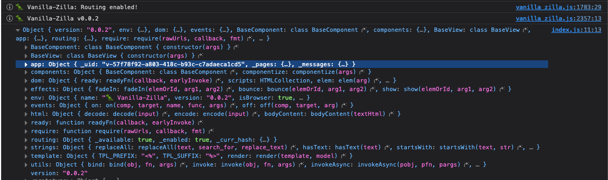

# Vanilla-Zilla


## Introduction and motivation

Vanilla-Zilla is a pure javascript library for modern vanilla javascript development with no need to 
struggle with configuration of NodeJs toolchain, Webpack, Vite, etc...

Why?

Because I hate to lose time with a ton of configuration files, version issues and many many different tools changing completely every few months.

Vanilla-Zilla is the library I'll use in all my projects.

## Vanilla-Zilla Architecture and Features

Vanilla-Zilla is a single javascript file.

When you run the file in a browser, Vanilla-Zilla creates a public object named `vanilla`.


To inspect the vanilla object you can call:

```javascript
console.log(vanilla);
```

Vanilla-Zilla has been built with "components" in mind. 
The idea is to be able to create components on different files separating the UI (HTML, CSS) from business logics.

Components, Views and Pages all inherit from BaseComponent.

- **BaseComponent**: Is an atomic object and can emit events.
- **BaseView**: Represents a View and usually contains Components or other views.
- **BasePage**: Is the top level element of an application and can contain child View and Components.

An Application is usually composed like this:

```
APP
 |- pages
      |- page_1 (HOME)
      |     |- view_1
      |     |   |- components...
      |     |- view_2
      |         |- components...
      |- pages...
```

Obviously, you can write the application as you want and with your preferred paradigm
completely ignoring the structure above.

Another thing to take in consideration is that Vanilla-Zilla methods are mostly async. 
So, is not rare to encounter a method that returns a Promise.


### Vanilla Object Structure

To inspect the vanilla object you can call:

```javascript
console.log(vanilla);
```



The `vanilla` object expose different objects and namespaces.


### Debugging the application

